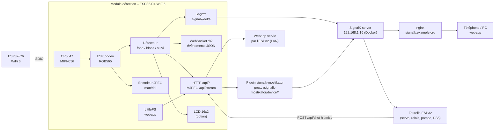
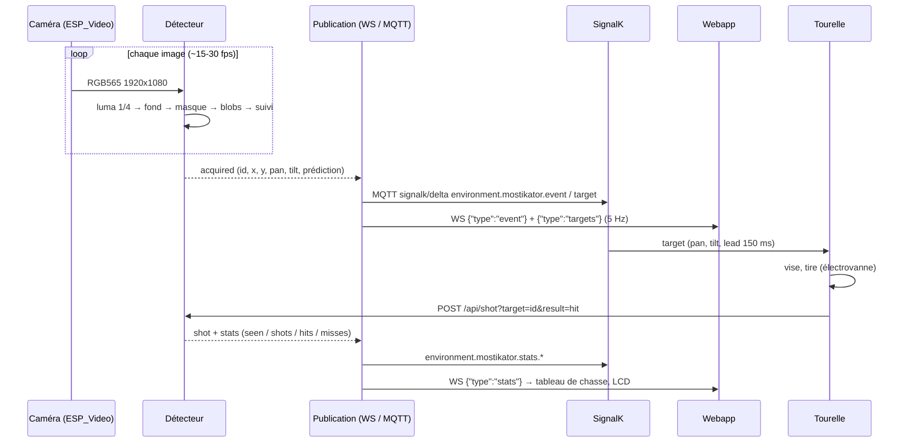
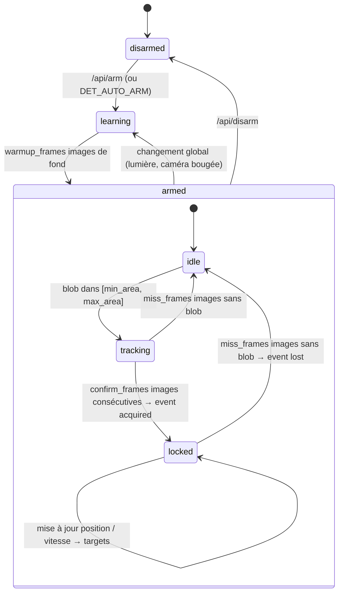

[](https://opensource.org/licenses/Apache-2.0)
[](https://signalk.org/)
[](https://www.espressif.com/)

# Mostikator — Le moustique a tort

> **L'Empire contre-attaque.**
> Mosquitoes, you've been warned. *The Empire strikes back.*

Tourelle anti-moustiques : un **module de détection** (ESP32-P4 + caméra) repère les moustiques,
publie leurs coordonnées sur **SignalK**, et une **tourelle** (canon à eau façon turbolaser) les arrose.

Ce dossier contient la partie **détection** :

| Dossier | Rôle |
|---------|------|
| `mostikator_esp32p4/` | Firmware Arduino pour la Waveshare ESP32-P4-WIFI6 : caméra MIPI-CSI, détection, API HTTP, WebSocket, MQTT → SignalK, LCD |
| `signalk-mostikator/` | Webapp Next.js (tableau de chasse, vidéo live avec cibles, réglages) + plugin SignalK (proxy vers l'ESP32). La même appli se déploie **sur SignalK** et **sur l'ESP32-P4** |

Le WiFi, le proxy SignalK, le déploiement et la PWA reprennent ce qui a été fait pour
[`signalk-esp-pond-sensor`](../signalk-esp-pond-sensor) (POI Laboratory).

---

## Architecture



```text
[ OV5647 MIPI-CSI ]
        |
        v
  ESP32-P4-WIFI6 ---- ESP32-C6 (WiFi, ESP-Hosted / SDIO)
        |
        |-- Détecteur : fond adaptatif -> masque -> blobs -> suivi -> cibles (x, y, pan, tilt, prédiction)
        |-- HTTP :80   /api/* (status, targets, config, arm, shot, capture, stream) + webapp (LittleFS)
        |-- WS   :82   évènements JSON (status, config, stats, targets, event)
        |-- MQTT       signalk/delta -> SignalK (environment.mostikator.*)
        |-- LCD 16x2   VU / TIR / OK / KO (option)
        '-- Watchdog 30s, reconnexion WiFi double SSID, NTP
                |
                v
        SignalK server ---- plugin signalk-mostikator (proxy) ---- nginx HTTPS ---- webapp
                |
                '--- Tourelle (lit environment.mostikator.target, renvoie le résultat du tir)
```

---

## Schéma de montage — module de détection

```text
                        Waveshare ESP32-P4-WIFI6 (32 MB flash, 32 MB PSRAM)
                       +-----------------------------------------------+
   Alim USB-C 5V ----->| USB-C (prog + série CDC)                      |
                       |                                               |
   OV5647 (nappe 15p)  | [MIPI-CSI 2 lanes]  SCCB : SDA GPIO7, SCL GPIO8|
   ======= nappe ======|  (Pi Camera v1 / module Waveshare OV5647)     |
                       |                                               |
                       | ESP32-C6 (WiFi 6) via SDIO GPIO14/15/18/19    |
                       |                                               |
                       | Header 2x20 :                                 |
   LCD 16x2 HD44780    |   RS  -> GPIO20      D4 -> GPIO22             |
   (option, 4 bits)    |   EN  -> GPIO21      D5 -> GPIO23             |
                       |                      D6 -> GPIO26             |
   VSS->GND VDD->5V    |                      D7 -> GPIO27             |
   V0 -> potar 10k     |   R/W -> GND   A -> 5V via 220 ohms  K -> GND |
                       |                                               |
   LED statut (option) |   LED_PIN (config.h) -> 220 ohms -> LED -> GND|
                       +-----------------------------------------------+
                                     |
                                WiFi (STA)
                                     |
                       SignalK 192.168.1.16 (MQTT 1883 + HTTP)
```

- **Caméra** : la carte n'accepte que les capteurs supportés par `esp_cam_sensor` (OV5647, OV5640, SC2336…).
  Le **module Pi Camera v3 (IMX708) n'a pas de driver** côté Espressif : utiliser un **OV5647**
  (Pi Camera v1 ou module Waveshare OV5647 72°). Le module OV5640 AF 24 pins de la liste est en DVP,
  pas MIPI : il ne se branche pas sur le connecteur CSI.
- **Champ de vision** : `CAM_HFOV_DEG` / `CAM_VFOV_DEG` (config.h, modifiable en live) servent à convertir
  les pixels en angles pan/tilt. Pi Camera v3 : 66° × 41°. OV5647 Waveshare : ~62° × 49°.
- **LCD** : `LCD_ENABLED 1` dans `config.h`. Broches modifiables (GPIO ≤ 36 recommandés sur le P4).
- La carte est alimentée en USB-C ; la tourelle a sa propre alimentation 12 V (pompe, électrovanne).

## Schéma de montage — tourelle (prochaine étape, pour mémoire)

```text
   Manette PS5 (BT) ---> ELEGOO ESP32 (lib esp-ps5) <--- WiFi ---> SignalK (cibles pan/tilt)
                              |
        +---------------------+----------------------+-----------------------+
        |                     |                      |                       |
   Servo pan (rotation)  Servo tilt (haut/bas)   Carte 4 relais 5V     HP + piezo (son laser)
   Futaba S3003          Futaba S3003            SRD-05VDC-SL-C         LED verte (jet vert)
        |                     |                      |
   Tourelle Lego         Canon cuivre + buse    +----+-----+
                                                |          |
                                        Electrovanne   Pompe 12V 5 l/min
                                        12V NF 1/4"    auto-amorçante
                                        (tir < 50 ms)  (pression 116 psi)
                                                |
                                          Réservoir d'eau
```

La tourelle lit `environment.mostikator.target` (pan/tilt prédits) sur SignalK ou le WebSocket de l'ESP32,
tire, puis renvoie le résultat : `POST http://<esp>/api/shot?target=<id>&result=hit|miss`.
Les corrections (vent, distance, tir de calibration) restent à faire côté tourelle.

---

## Flux de détection



## Machine à états du détecteur



---

## API HTTP du module (port 80)

Via SignalK : `https://signalk.example.org/signalk-mostikator/device/<route>` → `http://<esp>/api/<route>`.

| Route | Méthode | Description |
|-------|---------|-------------|
| `/api/status` | GET | État device / caméra / détecteur / stats (JSON) |
| `/api/targets` | GET | Cibles confirmées `{id, x, y, vx, vy, px, py, pan, tilt, w, h, confidence, age_ms}` |
| `/api/stats` | GET | Tableau de chasse |
| `/api/stats/reset` | POST | Remise à zéro |
| `/api/arm` / `/api/disarm` | POST | Armer / désarmer le détecteur |
| `/api/shot?target=<id>&result=hit\|miss` | POST | Résultat d'un tir (tourelle ou UI) |
| `/api/config` | GET / POST | Réglages détecteur + caméra (form-encoded), persistés en NVS. `reset=1` = valeurs d'usine |
| `/api/capture` | GET | Photo JPEG |
| `/api/stream` | GET | Flux MJPEG (4 clients max) |
| `/` | GET | Webapp (LittleFS), fallback SPA |

**WebSocket** `ws://<esp>:82/` : messages `{"type": "status" | "config" | "stats" | "targets" | "event"}`.
Commandes texte : `arm`, `disarm`, `ping`, `snapshot`.

Coordonnées : `x`, `y` normalisées (0..1, origine en haut à gauche), `px`/`py` = position prédite à `lead_ms`,
`pan` = (px − 0.5) × hfov, `tilt` = (0.5 − py) × vfov, en degrés par rapport à l'axe caméra.

## Chemins SignalK (publiés par MQTT, source `mostikator`)

| Chemin | Valeur |
|--------|--------|
| `environment.mostikator.detector.state` | `disarmed` / `learning` / `armed` |
| `environment.mostikator.detector.fps` | images/s traitées |
| `environment.mostikator.detector.activeTargets` | nombre de cibles |
| `environment.mostikator.target` | cible principale (objet, `null` quand plus rien) — 5 Hz max |
| `environment.mostikator.event` | `{event: acquired\|lost\|shot, target…}` |
| `environment.mostikator.stats.seen/shots/hits/misses` | compteurs |
| `environment.mostikator.camera.fps`, `.ready` | caméra |
| `environment.mostikator.device.rssi/uptime/ip` | device |

---

## Firmware `mostikator_esp32p4/`

### Prérequis

- **arduino-esp32 ≥ 3.3.11** (la bibliothèque `ESP_Video` pour la caméra MIPI-CSI n'existe pas avant ;
  la 3.3.7 installée localement ne suffit pas). Gestionnaire de cartes → esp32 → 3.3.11.
- Carte **ESP32P4 Dev Module** : PSRAM *Enabled*, Flash Size *32MB*, Partition Scheme *Custom*
  (le `partitions.csv` du dossier est pris automatiquement).
- **Chip Variant** : à faire correspondre à la bannière ROM du moniteur série. `ESP-ROM:esp32p4-eco2` (notre
  carte) = *Before v3.00* ; `eco5` = *v3.00 or newer*. Avec la mauvaise variante le bootloader plante en boucle
  (`Guru Meditation Error: Illegal instruction` avant tout log applicatif).
- **USB CDC On Boot** : *Disabled* si le câble est sur le port **UART** (puce CH343, `/dev/ttyACM0`),
  *Enabled* sur le port **USB** natif.
- Bibliothèques : `PubSubClient`, `WebSockets` (Links2004), `LiquidCrystal` (si LCD). Déjà installées.

### Configuration

```bash
cp mostikator_esp32p4/config.h.sample mostikator_esp32p4/config.h
```

`config.h` (ignoré par git) : WiFi principal + secours, `DEVICE_NAME`, `MQTT_HOST` (SignalK), broches caméra/LCD,
FOV, valeurs par défaut du détecteur. Tout le reste se règle en live via `POST /api/config` (persisté en NVS).

### Compilation / flash

Arduino IDE (Téléverser), ou en ligne de commande :

```bash
FQBN="esp32:esp32:esp32p4:PSRAM=enabled,FlashSize=32M,PartitionScheme=custom,ChipVariant=prev3,CDCOnBoot=default"
arduino-cli compile --fqbn "$FQBN" mostikator_esp32p4
arduino-cli upload  --fqbn "$FQBN" -p /dev/ttyACM0 mostikator_esp32p4
```

Moniteur série 115200 : `[CAM] Capture started 1920x1080`, `[WIFI] Connected`, `[MQTT] Connected`, `[DET] Armed`.
Si la caméra n'est pas détectée, la ligne `[CAM] SCCB scan:` liste les adresses I2C qui répondent :

| Ce qui répond | Interprétation |
|---|---|
| `0x18` seul | 0x18 = codec audio ES8311 de la carte. Aucune caméra : nappe à l'envers, mal enfoncée, ou absente |
| `0x36` | OV5647 — capteur supporté, doit démarrer |
| `0x3c` | OV5640 / OV5645 |
| `0x50 0x64` sans `0x1a` | **Pi Camera v3** : 0x64 = puce crypto ATSHA204A, 0x50 = EEPROM. Le capteur IMX708 (0x1a) reste muet car ses régulateurs sont pilotés par la broche 11 (CAM_GPIO) de la nappe 15 points, que la carte Waveshare ne commande pas. Et même alimenté, l'IMX708 n'a pas de driver `esp_cam_sensor` → module inutilisable, prendre un OV5647 |
| `0x10` | IMX219 (Pi Camera v2), pas de driver non plus |

### Comment marche la détection

1. **Luma réduite** : l'image RGB565 est réduite d'un facteur `downscale` (4 → 480×270) en niveaux de gris.
2. **Fond adaptatif** : moyenne glissante par pixel (`learn_shift` : 5 → 1/32 par image). `warmup_frames` images
   d'apprentissage à l'armement.
3. **Masque** : pixel plus sombre que le fond de plus de `threshold` (`dark_only`, un moustique est sombre sur un
   mur/ciel clair), dans la zone `roi`.
4. **Blobs** : composantes connexes 4-voisinage, gardées si `min_area ≤ aire ≤ max_area` (en pixels réduits).
   Trop de composantes = changement global (lumière) → réapprentissage du fond.
5. **Suivi** : association plus proche voisin (`max_match_dist`), vitesse lissée, prédiction à `lead_ms`.
   Une piste devient une **cible** après `confirm_frames` images, disparaît après `miss_frames` sans détection.
6. **Sortie** : coordonnées normalisées, pan/tilt, confiance ; évènements `acquired` / `lost` ; stats `seen`.

Premiers réglages sur le terrain : ouvrir la webapp, lancer le flux, armer, puis ajuster `threshold`
(faux positifs ↔ sensibilité), `min_area`/`max_area` (taille des moustiques à la distance de travail),
et la `roi` pour exclure les bords. La prochaine étape "IA" (modèle TFLite Micro sur le P4, `ESP_SR`/`TFLiteMicro`
sont dans le core) pourra s'insérer après l'étape 4 pour classer les blobs.

---

## Webapp + plugin `signalk-mostikator/`

Next.js 16 (export statique, Tailwind 4, PWA), même squelette que `signalk-poi-lab`. Deux cibles de build :

| Cible | Commande | Servie par | URL API |
|-------|----------|-----------|---------|
| SignalK | `npm run build:signalk` → `out/` | SignalK (`/signalk-mostikator/`) | `/signalk-mostikator/device/*` (proxy plugin) |
| ESP32 | `npm run build:esp` → `out-esp/` (via `deploy-esp.sh`) | l'ESP32-P4 depuis LittleFS (`http://<esp>/`) | `/api/*` + WebSocket :82 en direct |

Sur SignalK, les évènements temps réel viennent du flux SignalK (`environment.mostikator.*`) ; sur l'ESP32,
du WebSocket du module (pas de mixed-content, tout est en HTTP local).

### Développement

```bash
cd signalk-mostikator
cp .env.sample .env.local   # NEXT_PUBLIC_DEVICE_URL=http://<ip-esp32>
npm install
npm run dev                 # http://localhost:3000
```

### Déploiement sur SignalK

```bash
../chatel-signalk-weatherprovider/deploy-signalk.sh --mostikator
```

Le script build (`build:signalk`), copie `out/`, `index.js` et `package.json` dans le conteneur `signalk`
(`local-plugins/signalk-mostikator`) et redémarre SignalK. Ensuite, dans SignalK → Plugin Config → **Mostikator** :
renseigner l'IP de l'ESP32 (`deviceHost`) et activer le plugin. Webapp : `https://signalk.example.org/signalk-mostikator/`.

### Déploiement sur l'ESP32-P4

```bash
cd signalk-mostikator
./deploy-esp.sh                     # build:esp + image LittleFS + flash (/dev/ttyACM0)
./deploy-esp.sh --no-flash          # juste l'image mostikator.littlefs.bin
./deploy-esp.sh --port /dev/ttyUSB0
```

L'image est écrite dans la partition `spiffs` (offset `0x910000`, cf. `partitions.csv`) avec `mklittlefs` +
`esptool` du core esp32. Le firmware sert les fichiers `.gz` avec `Content-Encoding: gzip`.

---

## Notes d'origine

### Matériel

Détection :

- Waveshare ESP32-P4-WIFI6 — ESP32-P4 + ESP32-C6 (Wi-Fi 6, BLE 5), 32 MB flash, 32 MB PSRAM
- Module caméra v3 Raspberry Pi — angle standard 75° *(IMX708 : pas de driver ESP, voir plus haut → OV5647)*

Éventuellement :

- Raspberry Pi Zero WH
- Lot de 2 modules OV5640 AF 70° 5MP pour ESP32-CAM (24 broches 0,5 mm, DVP)
- Kit Arduino : 1 9V battery snap, jumper wires, 6 phototransistors, 3 potentiomètres 10k, 10 boutons poussoirs,
  1 TMP36, 1 tilt sensor, 1 LCD alphanumérique 16x2, LEDs (blanche, RGB, 8 rouges, 8 vertes, 8 jaunes, 3 bleues),
  1 moteur DC 6/9V, 1 servo, 1 piezo PKM22EPP-40, 1 L293D, 1 optocoupleur 4N35, 2 MOSFET IRF520,
  3 condensateurs 100µF, 5 diodes 1N4007, 3 gels (rouge, vert, bleu), 1 barrette mâle 40x1,
  résistances 220 Ω (20), 560 Ω (5), 1 kΩ (5), 4,7 kΩ (5), 10 kΩ (20), 1 MΩ (5), 10 MΩ (5)

Tourelle :

- Servo Futaba S3003 — https://content.arduino.cc/assets/servoMotor.PDF
- HP FCE 8 Ω 1 W
- Carte 4 relais 10 A 30 VDC SRD-05VDC-SL-C
- Électrovanne rapide 2 voies NF 1/4" NPT 12 V (réponse < 50 ms) — https://www.amazon.fr/dp/B08PZ5BV6B
- Pompe à eau 12 V 5 l/min 116 psi auto-amorçante — https://www.amazon.fr/dp/B0BN4J13G6
- ELEGOO 2× ESP-32 Type-C (WiFi + Bluetooth, CP2102) — https://www.amazon.fr/dp/B0D8T7LZF2

### À faire

- [ ] Schéma de montage détaillé de la tourelle (look turbolaser Star Wars)
- [ ] Canon à eau orientable haut/bas, rotation de la tourelle par moteur
- [ ] Tourelle en Lego + cuivre pour le canon et la buse
- [ ] Bruit de laser Star Wars et lumière verte sur le jet
- [ ] Contrôle manette PS5 (haut/bas, rotation, tir) ou position envoyée par le détecteur avec corrections
      auto (vent, distance, tir de calibration)
- [x] Module détection : envoi des coordonnées, suivi du tir et du résultat
- [x] Affichage mobile de la détection via signalk.example.org (webapp SignalK)
- [x] Affichage LCD : moustiques vus / tirs / réussis / loupés
- [ ] Classification des blobs par un modèle TFLite Micro (option)

## Licence

Apache-2.0
