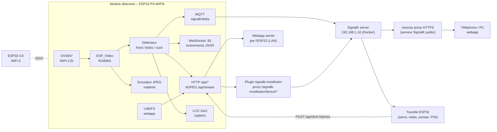
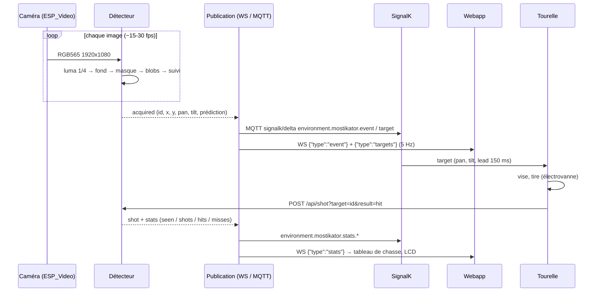
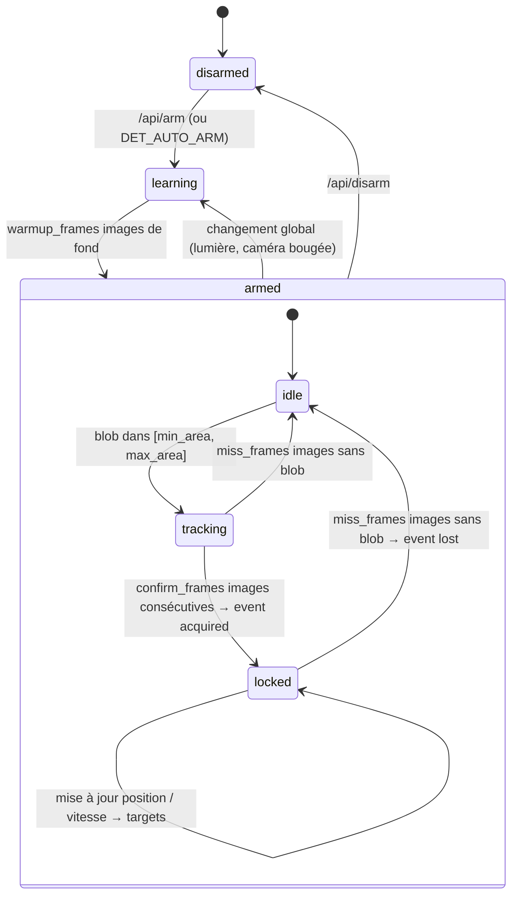

[](https://opensource.org/licenses/Apache-2.0)
[](https://signalk.org/)
[](https://www.espressif.com/)

# Mostikator — Le moustique a tort

> **L'Empire contre-attaque.**
> Mosquitoes, you've been warned. *The Empire strikes back.*

Tourelle anti-moustiques : un **module de détection** (ESP32-P4 + caméra) repère les moustiques,
publie leurs coordonnées sur **SignalK**, et une **tourelle** (canon à eau façon turbolaser) les arrose.

Ce dossier contient la partie **détection** et la partie **tourelle** :

| Dossier | Rôle |
|---------|------|
| `mostikator_esp32p4/` | Firmware Arduino pour la Waveshare ESP32-P4-WIFI6 : caméra MIPI-CSI, détection, API HTTP, WebSocket, MQTT → SignalK, LCD, son blaster sur le codec ES8311 embarqué |
| `mostikator_turret_esp32/` | Firmware Arduino pour l'ELEGOO ESP32 de la tourelle : manette PS5 (Bluetooth), servo tilt calibré, relais pompe/électrovanne/laser/LEDs vertes, son laser, maintenance WiFi (OTA + console telnet) |
| `signalk-mostikator/` | Webapp Next.js (tableau de chasse, vidéo live avec cibles, réglages) + plugin SignalK (proxy vers l'ESP32). La même appli se déploie **sur SignalK** et **sur l'ESP32-P4** |

Le WiFi, le proxy SignalK, le déploiement et la PWA reprennent ce qui a été fait pour
[`signalk-esp-pond-sensor`](../signalk-esp-pond-sensor) (POI Laboratory).

---

## Architecture



```text
[ OV5647 MIPI-CSI ]
        |
        v
  ESP32-P4-WIFI6 ---- ESP32-C6 (WiFi, ESP-Hosted / SDIO)
        |
        |-- Détecteur : fond adaptatif -> masque -> blobs -> suivi -> cibles (x, y, pan, tilt, prédiction)
        |-- HTTP :80   /api/* (status, targets, config, arm, shot, capture, stream) + webapp (LittleFS)
        |-- WS   :82   évènements JSON (status, config, stats, targets, event)
        |-- MQTT       signalk/delta -> SignalK (environment.mostikator.*)
        |-- LCD 16x2   VU / TIR / OK / KO (option)
        '-- Watchdog 30s, reconnexion WiFi double SSID, NTP
                |
                v
        SignalK server ---- plugin signalk-mostikator (proxy) ---- nginx HTTPS ---- webapp
                |
                '--- Tourelle (lit environment.mostikator.target, renvoie le résultat du tir)
```

---

## Schéma de montage — module de détection

```text
                        Waveshare ESP32-P4-WIFI6 (32 MB flash, 32 MB PSRAM)
                       +-----------------------------------------------+
   Alim USB-C 5V ----->| USB-C (prog + série CDC)                      |
                       |                                               |
   OV5647 (nappe 15p)  | [MIPI-CSI 2 lanes]  SCCB : SDA GPIO7, SCL GPIO8|
   ======= nappe ======|  (Pi Camera v1 / module Waveshare OV5647)     |
                       |                                               |
                       | ESP32-C6 (WiFi 6) via SDIO GPIO14/15/18/19    |
                       |                                               |
   Haut-parleur        | [Connecteur PH2.0 "SPK"]  <- rien a cabler    |
   8 ohms 2-3W  ------>|   codec ES8311 (0x18) + ampli NS4150B         |
                       |   I2S0 : MCLK 13, BCLK 12, WS 10, DOUT 9      |
                       |                                               |
   Tourelle ESP32      | Header 2x20 :                                 |
   GPIO16 (RX) <-------|   GPIO20 (TX)                                 |
   GPIO17 (TX) ------->|   GPIO21 (RX)      + masse commune            |
                       |                                               |
   LCD 16x2 (option,   |   RS  -> GPIO20 *     D4 -> GPIO22            |
   4 bits, exclusif    |   EN  -> GPIO21 *     D5 -> GPIO23            |
   du lien tourelle)   |                       D6 -> GPIO26            |
   VSS->GND VDD->5V    |                       D7 -> GPIO27            |
   V0 -> potar 10k     |   R/W -> GND   A -> 5V via 220 ohms  K -> GND |
                       |   * broches partagees avec le lien tourelle   |
                       |                                               |
   LED statut (option) |   LED_PIN (config.h) -> 220 ohms -> LED -> GND|
                       +-----------------------------------------------+
                                     |
                                WiFi (STA)
                                     |
                       SignalK 192.168.1.16 (MQTT 1883 + HTTP)
```

- **Caméra** : la carte n'accepte que les capteurs supportés par `esp_cam_sensor` (OV5647, OV5640, SC2336…).
  Le **module Pi Camera v3 (IMX708) n'a pas de driver** côté Espressif : utiliser un **OV5647**
  (Pi Camera v1 ou module Waveshare OV5647 72°). Le module OV5640 AF 24 pins de la liste est en DVP,
  pas MIPI : il ne se branche pas sur le connecteur CSI.
- **Champ de vision** : `CAM_HFOV_DEG` / `CAM_VFOV_DEG` (config.h, modifiable en live) servent à convertir
  les pixels en angles pan/tilt. Pi Camera v3 : 66° × 41°. OV5647 Waveshare : ~62° × 49°.
- **Son** : **rien à câbler**, le haut-parleur se branche sur le connecteur **PH2.0 « SPK »** de la carte.
  Elle embarque un codec **ES8311** (I2C **0x18**) et un ampli **NS4150B**. Brochage imposé par la carte,
  à ne pas modifier : I2S0 **MCLK GPIO13, BCLK GPIO12, WS GPIO10, DOUT GPIO9** (GPIO11 = micro, inutilisé),
  enable de l'ampli sur **GPIO53**. Volume : `AUDIO_VOLUME` (0-100 %) dans `config.h`.
  Le HP fourni avec ce genre de carte est un 8 Ω 2 W ; un HP plus gros sur le même connecteur donnera
  nettement plus de niveau, l'ampli tient 3 W sous 8 Ω.
- **Piège I2C** : l'ES8311 est sur **le même bus que la SCCB de la caméra** (GPIO7/8) — c'est pour ça qu'un
  scan sans caméra ne répond que `0x18`. Le driver caméra s'approprie le port définitivement, donc
  `audioBegin()` **doit** être appelé **avant** `cameraBegin()` : il configure le codec avec `Wire`,
  puis rend le bus (`Wire.end()`). Ne pas inverser l'ordre dans `setup()`, sinon plus de son.
- **Son blaster** : les échantillons sont **compilés dans le firmware** (pas de carte SD sur cette carte),
  dans `blaster_pcm.h` — 16 kHz mono, **4 tirs** enregistrés de 240 à 285 ms, 34 ko de flash. À chaque tir le
  firmware en joue un différent du précédent (tirage au hasard), pour qu'une rafale ne sonne pas en boucle.
  Source : « LASRGun_Blaster star wars (ID 0614) », [La Sonothèque](https://lasonotheque.org/) (banque de sons
  gratuits). Pour changer de son :
  `python3 tools/wav_to_blaster.py <fichier.wav> --out blaster_pcm.h --wav /tmp/preview.wav` découpe les tirs
  séparés par des silences, garde les `--shots` plus puissants (4 par défaut), rééchantillonne à 16 kHz, coupe le
  grave que le petit HP ne rend pas (`--highpass`, 250 Hz) et égalise les niveaux avec une légère saturation douce
  (`--drive`, 2 ; c'est elle qui fait le volume perçu d'un son qui décroît aussi vite). La prévisualisation WAV
  s'écoute sur PC. `tools/make_blaster.py` (synthèse physique d'un câble frappé) reste disponible en secours.
  La lecture se fait dans une tâche dédiée : un tir ne bloque jamais le serveur web ni le détecteur.
- **Lien série vers la tourelle** : `TURRET_LINK_TX_PIN 20` / `TURRET_LINK_RX_PIN 21` (UART2, 115200), voir
  la section tourelle pour le protocole. Inverser les deux `#define` si les fils sont croisés dans l'autre sens.
- **LCD** : `LCD_ENABLED 1` dans `config.h`. **Exclusif du lien tourelle** : RS/EN occupent GPIO20/21, il faut
  les déplacer sur des broches libres avant d'activer le LCD (le firmware refuse de compiler sinon).
  Broches modifiables (GPIO ≤ 36 recommandés sur le P4).
- La carte est alimentée en USB-C ; la tourelle a sa propre alimentation 12 V (pompe, électrovanne).

## Schéma de montage — tourelle

```text
   Manette PS5 (BT classic) ---> ELEGOO ESP32 (lib esp-ps5)
                                     |
                                     |  UART2 : GPIO17 (TX) -> P4 GPIO21
                                     |          GPIO16 (RX) <- P4 GPIO20
                                     |          GND commun        (3 fils)
                                     |          -> le P4 joue le blaster sur son HP
                                     |  WiFi : OTA (port 3232) + console telnet (port 23)
                                     |         mostikator-turret.local
                     +---------------+---------------+
                     |               |               |
                Servo tilt      Carte 4 relais     Piezo
                GPIO13          (actives LOW)      GPIO32
                Futaba S3003    IN1 pompe  GPIO26  (son laser)
                Haut / bas      IN2 vanne  GPIO27
                                IN3 laser  GPIO25
                                    LEDs   GPIO14  (éclairage vert du jet)
                                     |
                              +------+------+
                              |             |
                        Electrovanne    Pompe 12V 5 l/min
                        12V NF 1/4"     auto-amorçante
                        (tir < 50 ms)   (pression 116 psi)
                              |
                        Réservoir d'eau
```

- Servo alimenté en **5 V séparé** (pas le 3V3 de l'ESP32 : un S3003 en butée tire ~0,5 A), masse commune
  avec l'ESP32. Signal direct sur GPIO13 (tilt). Pas de servo de rotation pour l'instant : `PIN_SERVO_PAN -1`
  (l'angle pan reste suivi, rien n'est piloté ; remettre une broche libre pour en ajouter un).
- **Mémoire** : Bluetooth Classic + WiFi sur un ESP32 classique ne laissaient que ~20 Ko de RAM, et un pic TCP faisait
  planter lwIP (`abort()` dans `lock_init_generic`, tâche `tiT`, lu à distance avec `crash`). `ps5InputBegin()` démarre
  donc le contrôleur en **Classic seul** (`btStartMode(BT_MODE_CLASSIC_BT)`), ce qui libère la mémoire BLE : ~38 Ko libres.
- Carte relais SRD-05VDC-SL-C : VCC 5 V, GND commun, entrées **actives à l'état bas** (`RELAY_ACTIVE_LOW 1`).
  Le 12 V pompe/vanne passe par les contacts COM/NO des relais, jamais par l'ESP32.
  Relais 3 = laser de visée (coupé tout seul après `LASER_MAX_ON_MS`, 10 min, et dès que la manette est perdue),
  relais 4 = LEDs vertes du jet (allumées pendant chaque tir + `LED_AFTERGLOW_MS`, ou en permanence avec □).
  GPIO14 émet quelques impulsions pendant le boot ROM de l'ESP32 : le relais des LEDs peut claquer au démarrage.
  Dans `gunBegin()`, `pinMode(OUTPUT)` **avant** `digitalWrite()` : le core 3.x ignore l'écriture sur une broche
  pas encore déclarée, qui démarre alors à LOW = relais enclenché.
- Broches à éviter sur l'ESP32 : 0, 2, 12, 15 (strapping au boot) et 34-39 (entrées seules).
- **Lien série vers le module de détection** (`link.cpp` côté tourelle, `turret_link.cpp` côté P4) : la tourelle
  a son WiFi réservé à la maintenance et le HP est sur le P4, donc **3 fils** relient les deux
  cartes sur leur UART2 — TX2 GPIO17 → P4 GPIO21, RX2 GPIO16 ← P4 GPIO20, **masse commune obligatoire**.
  Les deux cartes sont en 3,3 V, pas d'adaptateur de niveau. Lignes ASCII terminées par `\n`, 115200 bauds :

  | Sens | Trame | Effet |
  |---|---|---|
  | Tourelle → P4 | `FIRE <ms>` | Émise par `openValve()`, donc **à chaque tir**, manette comprise → le P4 joue le blaster sur son HP |
  | Tourelle → P4 | `ARM 0\|1` | Armement / désarmement du canon |
  | Tourelle → P4 | `HB <armed\|safe> <tirs>` | Battement toutes les `LINK_HEARTBEAT_MS` (5 s) : garde `turretLinkConnected()` vrai côté P4 (timeout 15 s) |
  | P4 → tourelle | `AIM <pan> <tilt>` | Vise les angles donnés (mode auto) |
  | P4 → tourelle | `FIRE [ms]` | Déclenche une rafale (mode auto) |
  | P4 → tourelle | `PING` | La tourelle répond `PONG <armed\|safe> <tirs>` |

- **Manette connectée = mode manette**, la tourelle **refuse tout `AIM`, `FIRE` et `LASER`** venant du lien
  (refus tracé au plus une fois par seconde). **Clic sur le pavé tactile** = **mode caméra** (barre lumineuse
  violette) : la caméra vise et tire, la manette ne garde que le pavé (retour au mode manette) et Options
  (armer / désarmer l'eau). Manette éteinte ou perdue = mode caméra. La ligne `[STA]` de la console indique le
  mode (`auto allowed` / `manual (controller)`).
- Test du câblage sans eau : commande console **`pew`** sur la tourelle — elle envoie un `FIRE` sur le lien,
  le blaster doit sortir du HP branché sur le P4, sans ouvrir l'électrovanne.
- Le retour du résultat du tir (`POST /api/shot?target=<id>&result=hit|miss`) reste à faire.

### Mode automatique (caméra → tourelle)

`aim.cpp` sur le P4 : tant que le détecteur est armé et qu'une cible confirmée existe, la cible principale est
convertie en angles tourelle (`tourelle = gain × caméra + décalage`, par axe) et envoyée en `AIM <pan> <tilt>`
toutes les 50 ms ; le laser suit (`LASER 1`, éteint 1,5 s après la perte) ; après `aim_settle_ms` de visée un
`FIRE <aim_burst_ms>` part, au plus toutes les `aim_cooldown_ms`. **Canon désarmé = tir à blanc** : LEDs vertes,
son laser du piezo et blaster sur le HP du P4, pas d'eau. Tout se règle dans la webapp (Réglages du détecteur →
Mode automatique) ou par `POST /api/config` (`aim_*`), persisté en NVS (`mostik-aim`).

**Calibration laser ↔ caméra** : `mostikator_esp32p4/tools/calibrate_aim.py` (fond mat et clair, le point laser
doit tomber dans l'image). Il désarme le détecteur, pointe la tourelle à plusieurs angles, prend une photo laser
allumé et une laser éteint, trouve le point dans leur différence, ajuste la droite (points aberrants écartés) et
l'enregistre sur le P4 :

```bash
mostikator_esp32p4/tools/calibrate_aim.py --dry-run --save-images /tmp/calib   # mesurer seulement
mostikator_esp32p4/tools/calibrate_aim.py                                      # mesurer + enregistrer
```

Mesure du 2026-10-03 : `tilt tourelle = -2,06 × tilt caméra + 40,5°` (erreur max 1,7° sur 10 points) ; sans
servo de rotation, le laser reste sur la colonne x ≈ 0,37 de l'image (≈ 9° à gauche de l'axe), tracée en
pointillés rouges dans la webapp. Le bas de l'image (y > 0,7) demande plus de 60° de tilt : hors de portée.

### Manette PS5

| Bouton | Mode normal | Mode calibration (barre lumineuse bleue) |
|--------|-------------|------------------------------------------|
| Joystick gauche | Rotation (X) et haut/bas (Y) de la tourelle | — |
| Joystick droit | Idem, lent (visée fine) | — |
| Croix directionnelle | Ajuste de 1° | Pan gauche/droite, tilt bas/haut par pas de `step` µs (maintenir = répétition) |
| ✕ Croix | **Tir** (maintenu = jet continu, max `FIRE_MAX_MS`), R2 aussi | Marque la butée **basse** du tilt |
| ○ Rond | **Laser** on/off (relais 3) | Marque la butée **haute** du tilt |
| □ Carré | **LEDs vertes** on/off (relais 4) | Marque la butée gauche (**low**) du pan |
| △ Triangle | Recentre la tourelle | Marque la butée droite (**high**) du pan |
| L1 / R1 | L1 : pompe on/off (amorçage) | Pas ÷2 / ×2 |
| Options | **Armer / désarmer** (armer démarre la pompe) | **Sauvegarde** la calibration et quitte |
| Pavé tactile (clic) | **Mode caméra** ↔ mode manette (barre violette en mode caméra) | — |
| Create | **Maintenir 1,5 s** : entrer / sortir du mode calibration (un simple appui ne fait rien : PS + Create sert aussi à l'appairage) | Maintenir 1,5 s : sortir sans sauvegarder |

Barre lumineuse : orange = sécurité, vert = armé, rouge = tir (vibration), bleu = calibration, violet = mode caméra.
Manette perdue → vanne fermée, pompe coupée, laser et LEDs éteints, désarmé.

Appairage : maintenir **PS + Create** jusqu'à ce que la barre pulse en blanc. Tant qu'aucune manette n'est connue,
l'ESP32 scanne `PS5_PAIR_TIMEOUT_S` secondes au boot puis une fenêtre de 4 s toutes les 20 s. À la première connexion,
la MAC de la manette est **enregistrée en NVS** (`mostik-ps5/mac`) : aux boots suivants il s'y reconnecte directement,
sans scan, il suffit d'appuyer sur PS. `forget` sur la console pour changer de manette, ou fixer `PS5_MAC` dans `config.h`.

Si la manette connue ne répond pas pendant 30 s, la tourelle cherche **en plus** toutes les 20 s une manette en mode
appairage : une manette entre-temps appairée à une console ou un téléphone (elle a perdu la clé de la tourelle) revient
avec **PS + Create**, sans `forget` ni reboot. Une manette déjà appairée n'est pas visible au scan, donc rien n'est volé.
`net` sur la console affiche l'état du lien (`known`, `target`, `L2CAP up/down`, `channel pending`, nombre de scans).

**Bug de la lib esp-ps5 1.3.3 corrigé par patch** : quand une connexion sortante échoue (manette éteinte au boot,
page timeout), la lib garde le CID du canal et `isConnected()` ne réessaie **plus jamais** — seule la manette pouvait
alors rétablir le lien. `patches/esp-ps5-1.3.3-connect-retry.patch` libère le canal (et ajoute
`ps5_l2cap_drop_pending()`, appelé par la tourelle au bout de 12 s sans réponse). `deploy-ota.sh` l'applique tout
seul à `~/Arduino/libraries/esp-ps5` (variable `PS5_LIB` sinon) et prévient s'il ne s'applique plus (lib mise à jour).

Tout le Bluetooth tourne dans une **tâche dédiée** (cœur 0) : `ps5.isConnected()` de la lib esp-ps5 lance un scan
**bloquant** de ~5,5 s toutes les 5 s quand aucune manette n'est connue. Appelé depuis `loop()`, il gelait toute la
tourelle (vanne, lien P4, WiFi) manette éteinte. `loop()` ne touche à la lib que manette connectée.

### Réglage des servos (calibration)

Le firmware ne raisonne pas en « angle servo 0-180 » mais en **largeur d'impulsion** (µs) et en **angle réel**
de la tourelle (0° = axe caméra / canon horizontal, comme le `pan`/`tilt` du détecteur). Chaque axe est
défini par deux points : `(us, deg)` à la butée basse et `(us, deg)` à la butée haute. Entre les deux c'est
linéaire, et le servo n'est **jamais** envoyé au-delà des deux points (ni hors `SERVO_US_MIN..MAX`).

Le palonnier peut donc être monté n'importe comment (par exemple **tourelle en butée basse**) : ce n'est pas
la mécanique qu'on ajuste, c'est la table de correspondance qui est enregistrée en NVS.

Procédure, moniteur série 115200 (ou tout à la manette, voir tableau) :

```text
cal on                 # mode calibration : les angles sont ignorés, on pilote en µs
tilt 1500              # le canon bouge ; descendre par pas jusqu'à la butée basse mécanique
tilt -                 # (pas = 'step 10' par défaut, 'step 2' pour finir)
tilt -
mark tilt low -20      # cette impulsion = butée basse, le canon pointe à -20° (mesuré / estimé)
tilt 1900              # remonter jusqu'à la butée haute
mark tilt high 60      # cette impulsion = butée haute, canon à +60°
pan 1000 ... pan +     # pareil pour la rotation : gauche = low, droite = high
mark pan low -60
mark pan high 60
save                   # écrit en NVS ; 'show' pour relire, 'reset' pour revenir à config.h
angle 0 0              # test : doit viser droit devant, horizontal
```

- Ne jamais forcer contre une butée : si le servo grogne, revenir d'un pas avant de `mark`.
- Inverser le sens d'un axe = donner un `us` plus grand au point `low` qu'au point `high` (c'est accepté).
- Les angles réels servent au mode auto (cible du détecteur). Pour le pilotage manuel seul, peu importe
  qu'ils soient exacts, seules les deux butées comptent.
- À la manette, les angles utilisés par les marques sont ceux de `config.h` (`TILT_DEG_LOW`…) ; pour des
  valeurs mesurées, passer par la console.
- Calibration actuelle (mesurée et enregistrée le 2026-09-24) : **tilt 1540 µs = -20° / 1810 µs = 60°**. Elle est
  aussi recopiée dans les valeurs par défaut de `config.h` : un `reset` ou une NVS effacée retombe dessus.
  La NVS (`0x9000`) survit aux flashs USB et OTA tant qu'on ne fait pas d'« Erase flash ».
- `speed <deg/s>` limite la vitesse de balayage (défaut 150) ; `FIRE_MAX_MS` borne le jet même bouton maintenu.

### Firmware `mostikator_turret_esp32/`

```bash
cp mostikator_turret_esp32/config.h.sample mostikator_turret_esp32/config.h   # WiFi + OTA_PASSWORD
mostikator_turret_esp32/deploy-ota.sh --usb           # premier flash (ou secours) sur /dev/ttyUSB0
mostikator_turret_esp32/deploy-ota.sh                 # ensuite : compile + flash par WiFi (mostikator-turret.local)
mostikator_turret_esp32/deploy-ota.sh 192.168.1.131   # ou par IP si le mDNS ne résout pas
```

Arduino IDE : carte **ESP32 Dev Module**, partition **No FS 4MB (2MB APP x2)** (`PartitionScheme=no_fs`) : Bluedroid +
WiFi font ~1,7 Mo et l'OTA a besoin de deux emplacements. L'IDE voit aussi la tourelle comme port réseau
« mostikator-turret » (mot de passe = `OTA_PASSWORD`). Bibliothèque : `esp-ps5` (Hamza Yesilmen) ; les servos sont
pilotés par le LEDC du core (pas de lib).

**Maintenance à distance** — plus besoin du câble USB :

| Quoi | Comment |
|---|---|
| Mise à jour | `deploy-ota.sh` (espota, port 3232, mot de passe `OTA_PASSWORD`). Pendant l'OTA la vanne est fermée, la pompe, le laser et les LEDs coupés |
| Console | `telnet mostikator-turret.local` (ou `nc`), taper `OTA_PASSWORD` comme première ligne : mêmes commandes et même journal que le port série |
| Diagnostic | `show` (calibration, canon, manette, lien, WiFi), `net` (RSSI, IP, uptime, heap libre, cause du dernier reset), `crash` / `crash clear` (dernier plantage lu dans la partition core dump), `reboot`. Les 4 derniers Ko du journal (boot compris) s'affichent à la connexion |

Une seule console telnet à la fois (la nouvelle connexion remplace l'ancienne), 3 s de blocage après un mauvais mot
de passe. Le WiFi alterne entre `WIFI_SSID` et `WIFI_SSID2` (réseau de test et réseau de production) et, après une
coupure, réessaie d'abord celui qui marchait ; sans WiFi la tourelle marche pareil (manette + lien P4). La ligne
d'état `[STA]` n'est écrite que quand elle change (ou une fois par minute) pour que l'historique de 4 Ko garde le boot.
Console série : `help`, `scan` liste les appareils Bluetooth visibles, `pew` teste le lien série vers le module de
détection, `laser on|off` / `leds on|off` testent les relais 3 et 4.

Piège rencontré : arduino-esp32 3.x **libère la mémoire du contrôleur Bluetooth au boot** si aucune bibliothèque
liée ne déclare `btInUse()`. `esp-ps5` ne le fait pas → `btStart()` échoue en boucle avec
`initialize controller failed: ESP_ERR_INVALID_STATE` et aucune manette n'est jamais vue. Le firmware définit
donc `bool btInUse() { return true; }` (`ps5_input.cpp`). Compiler avec `DebugLevel=info` pour voir les logs
de la lib (`onDiscovery(): scan: ...`).

---

## Flux de détection



## Machine à états du détecteur



---

## API HTTP du module (port 80)

Via SignalK : `https://<serveur-signalk>/signalk-mostikator/device/<route>` → `http://<esp>/api/<route>`.

> **Mot de passe de contrôle** : les commandes (armer/désarmer, son, réglages, tirs, remise à zéro) exigent
> `CONTROL_PASSWORD` (`config.h`, `""` = pas de mot de passe) dans l'en-tête `X-Mostikator-Key` ; 5 erreurs bloquent
> les commandes une minute. La webapp le demande au premier refus (ou via 🔒 S'authentifier) et le garde dans le
> navigateur. La lecture (statut, flux, journal, vue détecteur) reste ouverte. L'eau ne sort que si le canon est
> armé **sur la tourelle** (Options ou `arm` sur la console) : ce n'est pas exposé en HTTP.

| Route | Méthode | Description |
|-------|---------|-------------|
| `/api/status` | GET | État device / caméra / détecteur / stats (JSON) |
| `/api/targets` | GET | Cibles confirmées `{id, x, y, vx, vy, px, py, pan, tilt, w, h, confidence, age_ms}` |
| `/api/stats` | GET | Tableau de chasse |
| `/api/stats/reset` | POST | Remise à zéro |
| `/api/arm` / `/api/disarm` | POST | Armer / désarmer le détecteur |
| `/api/shot?target=<id>&result=hit\|miss` | POST | Résultat d'un tir (tourelle ou UI) |
| `/api/config` | GET / POST | Réglages détecteur + caméra (form-encoded), persistés en NVS. `reset=1` = valeurs d'usine |
| `/api/capture` | GET | Photo JPEG |
| `/api/stream` | GET | Flux MJPEG (4 clients max) |
| `/api/auth` | GET | 200 si `X-Mostikator-Key` est bon (ou pas de mot de passe), 401 sinon |
| `/api/detector.bmp` | GET | Vue détecteur (BMP 8 bits de la grille de travail) |
| `/api/log` | GET | Fin du journal du firmware (texte, 32 Ko), même historique que la console telnet — carte « Journal du détecteur » de la webapp |
| `/` | GET | Webapp (LittleFS), fallback SPA |

**WebSocket** `ws://<esp>:82/` : messages `{"type": "status" | "config" | "stats" | "targets" | "event"}`.
Commandes texte : `arm`, `disarm`, `ping`, `snapshot`.

Coordonnées : `x`, `y` normalisées (0..1, origine en haut à gauche), `px`/`py` = position prédite à `lead_ms`,
`pan` = (px − 0.5) × hfov, `tilt` = (0.5 − py) × vfov, en degrés par rapport à l'axe caméra.

## Chemins SignalK (publiés par MQTT, source `mostikator`)

| Chemin | Valeur |
|--------|--------|
| `environment.mostikator.detector.state` | `disarmed` / `learning` / `armed` |
| `environment.mostikator.detector.fps` | images/s traitées |
| `environment.mostikator.detector.activeTargets` | nombre de cibles |
| `environment.mostikator.target` | cible principale (objet, `null` quand plus rien) — 5 Hz max |
| `environment.mostikator.event` | `{event: acquired\|lost\|shot, target…}` |
| `environment.mostikator.stats.seen/shots/hits/misses` | compteurs |
| `environment.mostikator.camera.fps`, `.ready` | caméra |
| `environment.mostikator.device.rssi/uptime/ip` | device |

---

## Firmware `mostikator_esp32p4/`

### Prérequis

- **arduino-esp32 ≥ 3.3.11** (la bibliothèque `ESP_Video` pour la caméra MIPI-CSI n'existe pas avant).
  Testé en **3.3.12**. Gestionnaire de cartes → esp32.
- Carte **ESP32P4 Dev Module** : PSRAM *Enabled*, Flash Size *32MB*, Partition Scheme *Custom*
  (le `partitions.csv` du dossier est pris automatiquement).
- **Chip Variant** : à faire correspondre à la bannière ROM du moniteur série. `ESP-ROM:esp32p4-eco2` (notre
  carte) = *Before v3.00* ; `eco5` = *v3.00 or newer*. Avec la mauvaise variante le bootloader plante en boucle
  (`Guru Meditation Error: Illegal instruction` avant tout log applicatif).
- **USB CDC On Boot** : *Disabled* si le câble est sur le port **UART** (puce CH343, `/dev/ttyACM0`),
  *Enabled* sur le port **USB** natif.
- Bibliothèques : `PubSubClient`, `WebSockets` (Links2004), `LiquidCrystal` (si LCD). Déjà installées.
  `ESP_I2S` (audio) est fourni par le core, rien à installer.

### Configuration

```bash
cp mostikator_esp32p4/config.h.sample mostikator_esp32p4/config.h
```

`config.h` (ignoré par git) : WiFi principal + secours, `DEVICE_NAME`, `OTA_PASSWORD`, `MQTT_HOST` (SignalK), broches caméra/LCD,
FOV, valeurs par défaut du détecteur. Tout le reste se règle en live via `POST /api/config` (persisté en NVS).

WiFi : `WIFI_SSID` / `WIFI_SSID2` sont les deux réseaux (test et production). Le module essaie d'abord le dernier
réseau qui a fonctionné, passe à l'autre dès que le premier est signalé absent (au lieu d'attendre les 30 s du
timeout ESP-Hosted), et redémarre après 10 tours sans réseau.

### Compilation / flash

Arduino IDE (Téléverser), ou en ligne de commande :

```bash
mostikator_esp32p4/deploy-ota.sh --usb            # premier flash (ou secours) sur /dev/ttyACM0
mostikator_esp32p4/deploy-ota.sh                  # ensuite : compile + flash par WiFi (mostikator-p4-01.local)
mostikator_esp32p4/deploy-ota.sh 192.168.1.32     # ou par IP
```

(FQBN utilisé : `esp32:esp32:esp32p4:PSRAM=enabled,FlashSize=32M,PartitionScheme=custom,ChipVariant=prev3,CDCOnBoot=default`.)

**Maintenance à distance** (`remote.cpp`) — plus besoin du câble USB :

| Quoi | Comment |
|---|---|
| Firmware | `deploy-ota.sh` (espota, port `OTA_PORT` 3232, mot de passe `OTA_PASSWORD`), slots `app0`/`app1` de `partitions.csv` |
| Webapp | `signalk-mostikator/deploy-esp.sh --ota` : image LittleFS envoyée par OTA (`espota -s`), la carte redémarre ensuite |
| Console | `telnet mostikator-p4-01.local` (ou `nc`), `OTA_PASSWORD` comme première ligne : l'historique du journal (64 Ko en PSRAM, boot compris) s'affiche, puis le direct. Commandes : `help`, `status`, `stats`, `config`, `net`, `arm`/`disarm`, `pew`, `ping` (tourelle), `turret <ligne>`, `reboot`. Les mêmes commandes marchent sur le port série |
| Journal HTTP | `GET /api/log`, aussi via le proxy SignalK depuis l'extérieur, et carte « Journal du détecteur » de la webapp |
| Plantage | Au boot après un panic, et par `crash` : tâche, PC, cause. `crash raw` sort le dump complet en base64 (console seulement : un dump mémoire peut contenir le mot de passe WiFi), à décoder avec `esp-coredump info_corefile --core-format raw -c dump.bin <elf>`. `crash clear` l'efface |

**Décoder un plantage** : chaque `deploy-ota.sh` archive l'ELF compilé dans `~/.mostikator-builds/`. Le dump ne se
décode qu'avec l'ELF exact qui a planté (vérification SHA256) : `xtensa-esp32-elf-addr2line -pfiaC -e <elf> <PC> <backtrace>`
pour la tourelle, `esp-coredump --chip esp32p4 info_corefile --gdb riscv32-esp-elf-gdb ...` pour le P4.

Tous les modules journalisent par `Log.printf()` (et non `Serial.printf()`) : le port série est écrit tout de suite,
l'historique est un tampon circulaire protégé par spinlock, et seule `loop()` touche au réseau. Les tâches caméra,
détecteur, audio et MJPEG peuvent donc écrire dans le journal sans jamais bloquer sur telnet.

Moniteur série 115200 : `[CAM] Capture started 1920x1080`, `[WIFI] Connected`, `[MQTT] Connected`, `[DET] Armed`.
Si la caméra n'est pas détectée, la ligne `[CAM] SCCB scan:` liste les adresses I2C qui répondent :

| Ce qui répond | Interprétation |
|---|---|
| `0x18` seul | 0x18 = codec audio ES8311 de la carte. Aucune caméra : nappe à l'envers, mal enfoncée, ou absente |
| `0x36` | OV5647 — capteur supporté, doit démarrer |
| `0x3c` | OV5640 / OV5645 |
| `0x50 0x64` sans `0x1a` | **Pi Camera v3** : 0x64 = puce crypto ATSHA204A, 0x50 = EEPROM. Le capteur IMX708 (0x1a) reste muet car ses régulateurs sont pilotés par la broche 11 (CAM_GPIO) de la nappe 15 points, que la carte Waveshare ne commande pas. Et même alimenté, l'IMX708 n'a pas de driver `esp_cam_sensor` → module inutilisable, prendre un OV5647 |
| `0x10` | IMX219 (Pi Camera v2), pas de driver non plus |

### Comment marche la détection

1. **Luma réduite** : l'image RGB565 est réduite d'un facteur `downscale` en niveaux de gris (3 → 266×266 pour le
   mode 800×800, 18 images/s ; 2 → 400×400 mais 9 images/s ; 4 → 200×200). **La taille compte** : à 1 m, un
   pixel caméra fait ~1,6 mm, un moustique ~3 pixels. Avec `downscale 4` et `min_area 4` il fallait un objet de
   ~1,3 cm : ni un moustique ni le point laser n'étaient vus, seulement une main.
2. **Fond adaptatif** : moyenne glissante par pixel (`learn_shift` : 5 → 1/32 par image). `warmup_frames` images
   d'apprentissage à l'armement.
3. **Masque** : pixel plus sombre que le fond de plus de `threshold + noise_k × bruit du pixel` (`dark_only`, un
   moustique est sombre sur un mur/ciel clair), dans la zone `roi`. Avec `dark_only`, les pixels qui
   s'éclaircissent (point laser, reflet) ne sont appris que très lentement (1/1024) : sinon la tache laissée par le
   laser paraissait « plus sombre que le fond » et la tourelle poursuivait son propre laser. Le moustique tigre est
   noir rayé de blanc : sur un fond clair il reste sombre ; décocher `dark_only` fait aussi détecter le laser. Chaque pixel apprend son propre **bruit**
   (moyenne glissante de |luma − fond|) : les bords nets qui tremblent avec les vibrations ou l'auto-exposition,
   les lampes qui scintillent et les zones sombres bruitées relèvent seuls leur seuil, un mur uni garde toute la
   sensibilité. `noise_k` 0 = ancien comportement.
   Si plus de `global_change_pct` % de la zone change d'un coup (secousse, pas d'exposition, lumière allumée),
   l'image est ignorée pour le suivi (`global_skips` dans `/api/status`).
4. **Blobs** : composantes connexes 4-voisinage, gardées si `min_area ≤ aire ≤ max_area` (en pixels réduits) et,
   avec `isolation`, si la couronne autour de la tache (2 × sa taille) contient moins de pixels changés qu'elle :
   un moustique est seul dans le ciel, alors que le contour d'une tête ou d'un bras qui bouge se brise en petits
   morceaux voisins de la même taille. Trop de composantes = changement global → réapprentissage du fond.
5. **Suivi** : association plus proche voisin (`max_match_dist`), vitesse lissée, prédiction à `lead_ms`.
   Une piste devient une **cible** après `confirm_frames` images, disparaît après `miss_frames` sans détection.
6. **Sortie** : coordonnées normalisées, pan/tilt, confiance ; évènements `acquired` / `lost` ; stats `seen`.

Mesure du 2026-09-24 (intérieur, faible lumière, tourelle qui bouge toutes les 2 s, même scène en A/B) : 14 fausses
cibles/min avec l'ancien masque, **0** avec `noise_k 3` ; au calme 6 → 0-2/min, le reste venant d'une personne qui
bouge au bord de l'image.

**Vue détecteur** (bouton 🔬 de la webapp, `GET /api/detector.bmp`) : la grille de travail telle que le détecteur la
voit, rafraîchie ~3 fois par seconde — rouge = changement compté, cyan = changement clair ignoré (`dark_only`),
jaune = zone `roi`.

Mesure du 2026-10-03 (mur clair, fenêtre exclue de la `roi`) : `min_area 1` laisse passer le bruit du capteur
(15 fausses cibles/min), `min_area 2` → 0/min, mode automatique compris.

Premiers réglages sur le terrain : ouvrir la webapp, lancer le flux, armer, puis ajuster `threshold`
(faux positifs ↔ sensibilité), `min_area`/`max_area` (taille des moustiques à la distance de travail),
et la `roi` pour exclure les bords. La prochaine étape "IA" (modèle TFLite Micro sur le P4, `ESP_SR`/`TFLiteMicro`
sont dans le core) pourra s'insérer après l'étape 4 pour classer les blobs.

---

## Webapp + plugin `signalk-mostikator/`

Next.js 16 (export statique, Tailwind 4, PWA), même squelette que `signalk-poi-lab`. Deux cibles de build :

| Cible | Commande | Servie par | URL API |
|-------|----------|-----------|---------|
| SignalK | `npm run build:signalk` → `out/` | SignalK (`/signalk-mostikator/`) | `/signalk-mostikator/device/*` (proxy plugin) |
| ESP32 | `npm run build:esp` → `out-esp/` (via `deploy-esp.sh`) | l'ESP32-P4 depuis LittleFS (`http://<esp>/`) | `/api/*` + WebSocket :82 en direct |

Sur SignalK, les évènements temps réel viennent du flux SignalK (`environment.mostikator.*`) ; sur l'ESP32,
du WebSocket du module (pas de mixed-content, tout est en HTTP local).

### Développement

```bash
cd signalk-mostikator
cp .env.sample .env.local   # NEXT_PUBLIC_DEVICE_URL=http://<ip-esp32>
npm install
npm run dev                 # http://localhost:3000
```

### Déploiement sur SignalK

```bash
../chatel-signalk-weatherprovider/deploy-signalk.sh --mostikator
```

Le script build (`build:signalk`), copie `out/`, `index.js` et `package.json` dans le conteneur `signalk`
(`local-plugins/signalk-mostikator`) et redémarre SignalK. Ensuite, dans SignalK → Plugin Config → **Mostikator** :
activer le plugin. Webapp : `https://<serveur-signalk>/signalk-mostikator/`.

Le proxy **suit tout seul l'adresse du module** : le P4 publie son IP sur `environment.mostikator.device.ip` (MQTT),
ce qui couvre le DHCP sans réservation et le passage d'un WiFi à l'autre. `deviceHost` ne sert que de repli tant que
rien n'a été publié. Les noms mDNS (`.local`) ou du routeur (`.home`) ne se résolvent pas dans le conteneur Docker de
SignalK, d'où ce choix. Le proxy refuse les chemins contenant `..`.

### Déploiement sur l'ESP32-P4

```bash
cd signalk-mostikator
./deploy-esp.sh                     # build:esp + image LittleFS + flash (/dev/ttyACM0)
./deploy-esp.sh --no-flash          # juste l'image mostikator.littlefs.bin
./deploy-esp.sh --port /dev/ttyUSB0
./deploy-esp.sh --ota               # build:esp + image + envoi par WiFi (mostikator-p4-01.local)
./deploy-esp.sh --ota 192.168.1.31
```

L'image est écrite dans la partition `spiffs` (offset `0x910000`, cf. `partitions.csv`) avec `mklittlefs` +
`esptool` du core esp32. Le firmware sert les fichiers `.gz` avec `Content-Encoding: gzip`.

---

## Notes d'origine

### Matériel

Détection :

- Waveshare ESP32-P4-WIFI6 — ESP32-P4 + ESP32-C6 (Wi-Fi 6, BLE 5), 32 MB flash, 32 MB PSRAM
- Module caméra v3 Raspberry Pi — angle standard 75° *(IMX708 : pas de driver ESP, voir plus haut → OV5647)*

Éventuellement :

- Raspberry Pi Zero WH
- Lot de 2 modules OV5640 AF 70° 5MP pour ESP32-CAM (24 broches 0,5 mm, DVP)
- Kit Arduino : 1 9V battery snap, jumper wires, 6 phototransistors, 3 potentiomètres 10k, 10 boutons poussoirs,
  1 TMP36, 1 tilt sensor, 1 LCD alphanumérique 16x2, LEDs (blanche, RGB, 8 rouges, 8 vertes, 8 jaunes, 3 bleues),
  1 moteur DC 6/9V, 1 servo, 1 piezo PKM22EPP-40, 1 L293D, 1 optocoupleur 4N35, 2 MOSFET IRF520,
  3 condensateurs 100µF, 5 diodes 1N4007, 3 gels (rouge, vert, bleu), 1 barrette mâle 40x1,
  résistances 220 Ω (20), 560 Ω (5), 1 kΩ (5), 4,7 kΩ (5), 10 kΩ (20), 1 MΩ (5), 10 MΩ (5)

Tourelle :

- Servo Futaba S3003 — https://content.arduino.cc/assets/servoMotor.PDF
- HP FCE 8 Ω 1 W
- Carte 4 relais 10 A 30 VDC SRD-05VDC-SL-C
- Électrovanne rapide 2 voies NF 1/4" NPT 12 V (réponse < 50 ms) — https://www.amazon.fr/dp/B08PZ5BV6B
- Pompe à eau 12 V 5 l/min 116 psi auto-amorçante — https://www.amazon.fr/dp/B0BN4J13G6
- ELEGOO 2× ESP-32 Type-C (WiFi + Bluetooth, CP2102) — https://www.amazon.fr/dp/B0D8T7LZF2

### À faire

- [ ] Schéma de montage détaillé de la tourelle (look turbolaser Star Wars)
- [ ] Canon à eau orientable haut/bas, rotation de la tourelle par moteur
- [ ] Tourelle en Lego + cuivre pour le canon et la buse
- [x] Bruit de laser Star Wars et lumière verte sur le jet (piezo sur la tourelle + codec ES8311 et HP sur le P4)
- [x] Contrôle manette PS5 (haut/bas, rotation, tir, LEDs) + calibration des servos en NVS
- [x] Visée et tir automatiques depuis la caméra (lien série), laser qui suit, calibration laser ↔ caméra
- [ ] Corrections auto (vent, distance), servo de rotation (pan)
- [x] Module détection : envoi des coordonnées, suivi du tir et du résultat
- [x] Affichage mobile de la détection via la webapp SignalK
- [x] Affichage LCD : moustiques vus / tirs / réussis / loupés
- [ ] Classification des blobs par un modèle TFLite Micro (option)

## Licence

Apache-2.0
